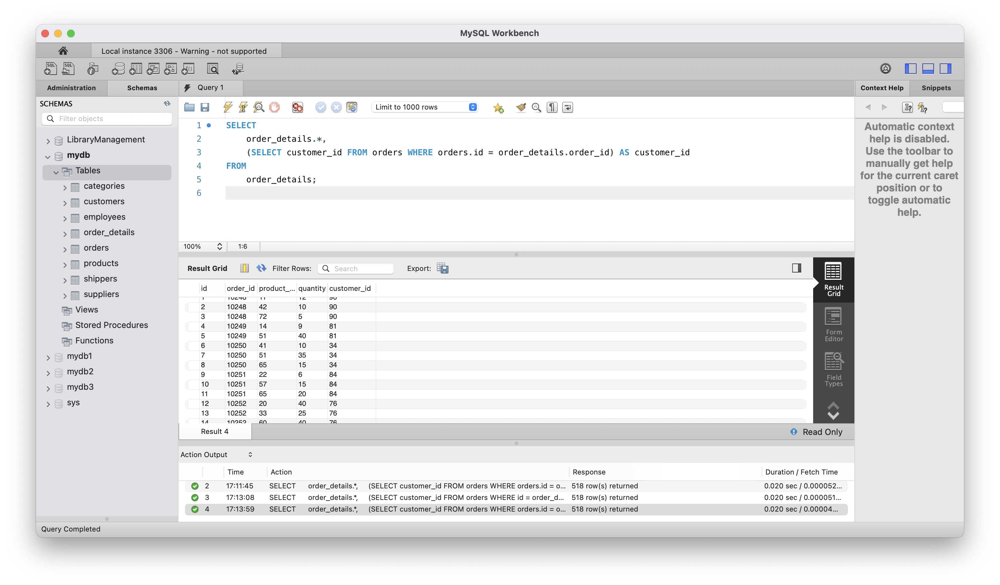
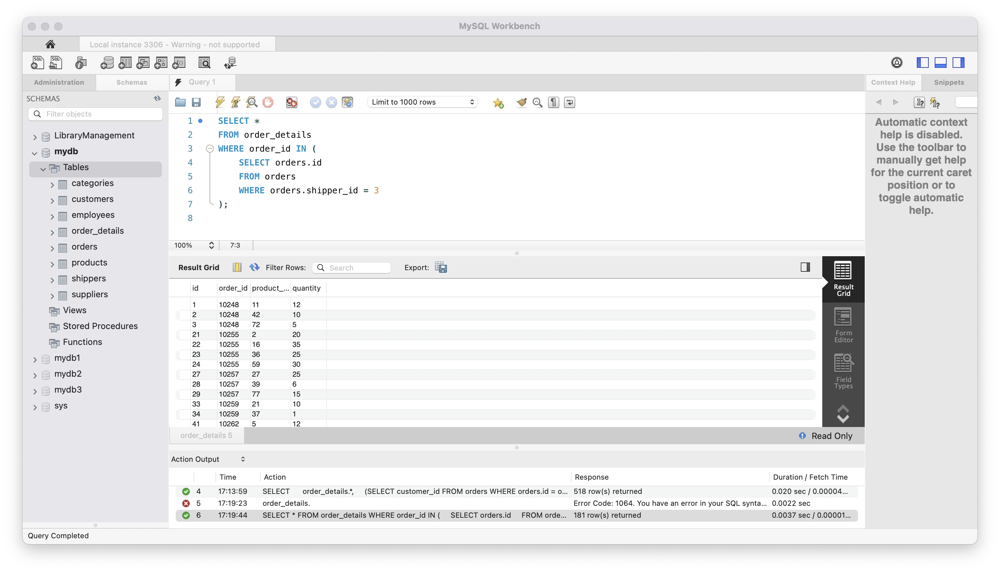
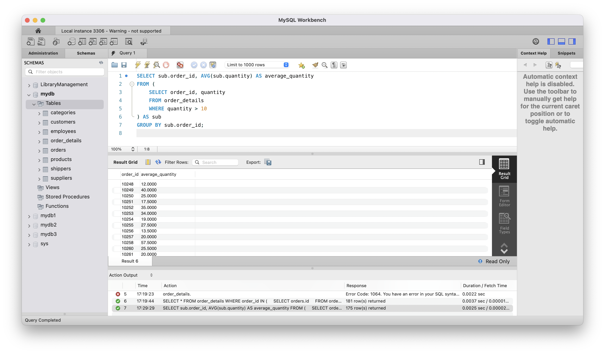
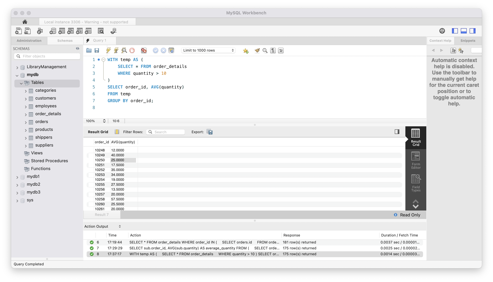
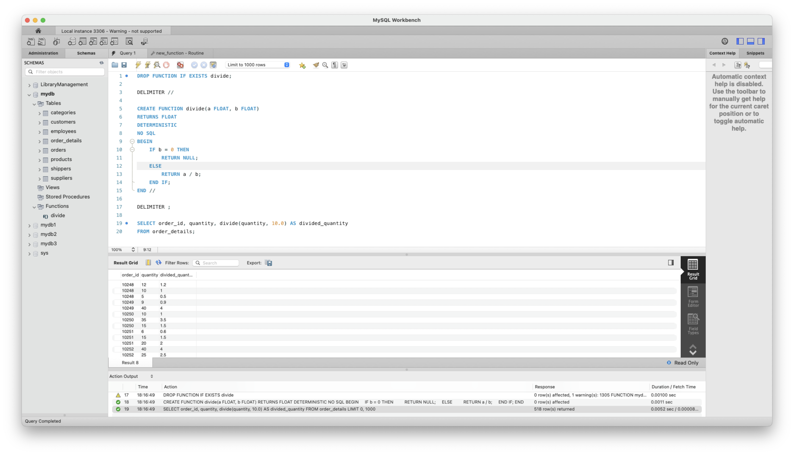

# goit-rdb-hw-05

## Завдання 1

Напишіть SQL запит, який буде відображати таблицю order_details та поле customer_id з таблиці orders відповідно для кожного поля запису з таблиці order_details.

Це має бути зроблено за допомогою вкладеного запиту в операторі SELECT.

## Розвязання завдання 1



```sql
SELECT
    order_details.*,
    (SELECT customer_id FROM orders WHERE orders.id = order_details.order_id) AS customer_id
FROM
    order_details;
```

## Завдання 2

Напишіть SQL запит, який буде відображати таблицю order_details. Відфільтруйте результати так, щоб відповідний запис із таблиці orders виконував умову shipper_id=3.

Це має бути зроблено за допомогою вкладеного запиту в операторі WHERE.

## Розвязання завдання 2



```sql
SELECT *
FROM order_details
WHERE order_id IN (
    SELECT orders.id
    FROM orders
    WHERE orders.shipper_id = 3
);
```

## Завдання 3

Напишіть SQL запит, вкладений в операторі FROM, який буде обирати рядки з умовою quantity>10 з таблиці order_details. Для отриманих даних знайдіть середнє значення поля quantity — групувати слід за order_id.

## Розвязання завдання 3



```sql
SELECT sub.order_id, AVG(sub.quantity) AS average_quantity
FROM (
    SELECT order_id, quantity
    FROM order_details
    WHERE quantity > 10
) AS sub
GROUP BY sub.order_id;

```

## Завдання 4

Розв’яжіть завдання 3, використовуючи оператор WITH для створення тимчасової таблиці temp. Якщо ваша версія MySQL більш рання, ніж 8.0, створіть цей запит за аналогією до того, як це зроблено в конспекті.

## Розвязання завдання 4



```sql
WITH temp AS (
    SELECT * FROM order_details
    WHERE quantity > 10
)
SELECT order_id, AVG(quantity)
FROM temp
GROUP BY order_id;
```

## Завдання 5

Створіть функцію з двома параметрами, яка буде ділити перший параметр на другий. Обидва параметри та значення, що повертається, повинні мати тип FLOAT.

Використайте конструкцію DROP FUNCTION IF EXISTS. Застосуйте функцію до атрибута quantity таблиці order_details . Другим параметром може бути довільне число на ваш розсуд.

## Розвязання завдання 5



```sql
DROP FUNCTION IF EXISTS divide;

DELIMITER //

CREATE FUNCTION divide(a FLOAT, b FLOAT)
RETURNS FLOAT
DETERMINISTIC
NO SQL
BEGIN
    IF b = 0 THEN
        RETURN NULL;
    ELSE
        RETURN a / b;
    END IF;
END //

DELIMITER ;

SELECT order_id, quantity, divide(quantity, 10.0) AS divided_quantity
FROM order_details;
```
